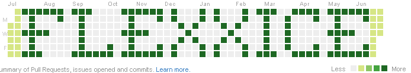

<link href="style.css" rel="stylesheet"></link>

# Yoo,  here 👋

-   🔭 I’m currently working on some small private projects
-   🌱 I’m currently learning to extend my knowledge about Python
-   💬 Fun fact: As viewable above, I have a knack for following through on some not-so-well-thought-out ideas just to see how they end up.

<!--
**FlexxicE/FlexxicE** is a ✨ _special_ ✨ repository because its `README.md` (this file) appears on your GitHub profile.

Here are some ideas to get you started:

- 🔭 I’m currently working on ...
- 🌱 I’m currently learning ...
- 👯 I’m looking to collaborate on ...
- 🤔 I’m looking for help with ...
- 💬 Ask me about ...
- 📫 How to reach me: ...
- 😄 Pronouns: ...
- ⚡ Fun fact: ...
-->
